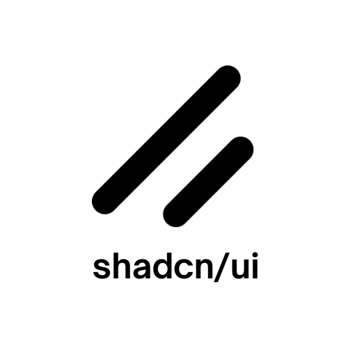
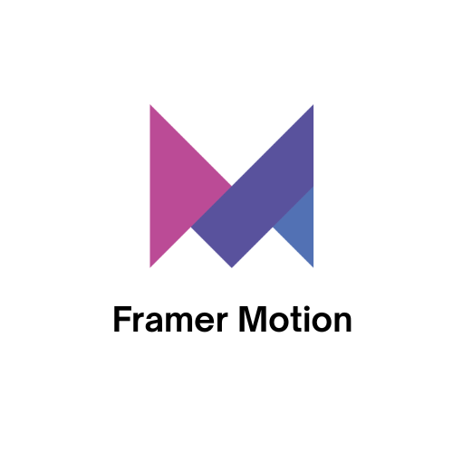

## Hello there! 👋

I am Christopher A. Quinto, a front-end developer

Feel free to explore some of the projects that I've built

## Technologies I've used

<h4>Languages and Frameworks</h4>

    
    
    
    
    

<h4>Styling and UI</h4>

    
    

<h4>APIs and Libraries</h4>

    
    
    

## Projects

<h3>MIS InvTrack</h3>

MIS InvTrack is an inventory management system specifically designed to track distributed gadgets like
laptops and tablets, streamline the administration of repairs, and facilitate efficient claims and returns
processes. It aims to provide comprehensive oversight of all gadget-related operations, ensuring accurate
record-keeping and smooth workflow for an organization's inventory

<a href="https://misinvtrack.42web.io" target="_blank">Try MIS InvTrack's Demo →</a>

 

<h3>TaskM</h3>

TaskM is a simple, elegant task manager built with user authentication, a modern UI, AI-assisted task suggestions, and a connected database, all deployed and ready to use.

<a href="https://task-m-three.vercel.app" target="_blank">Try TaskM's Demo →</a>
